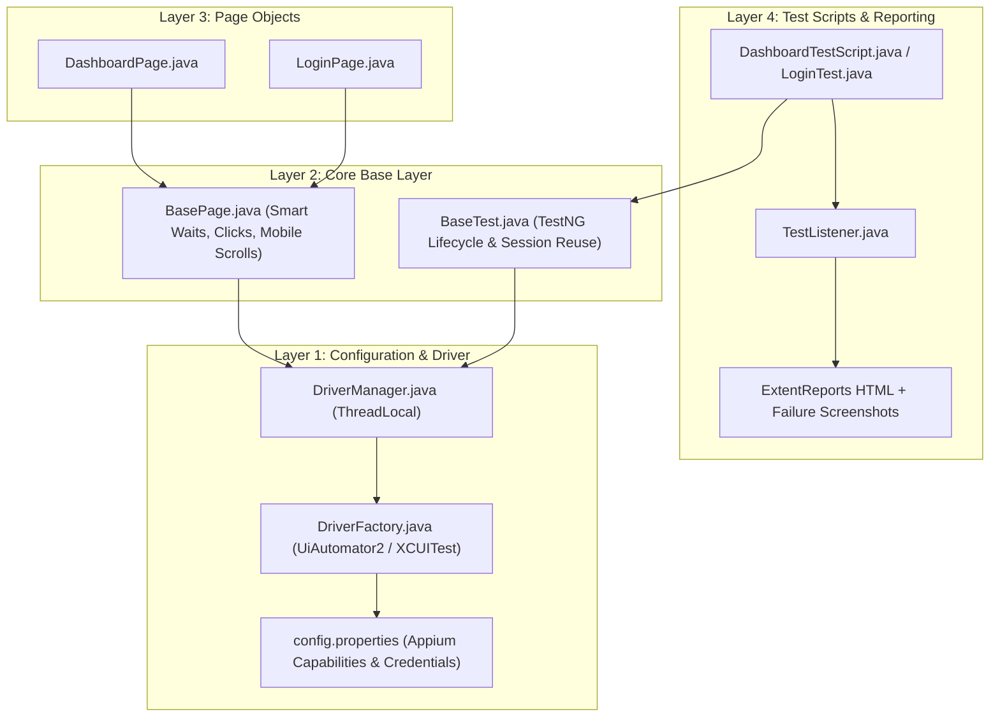
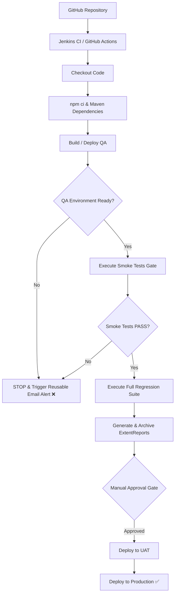

# ITSM Mobile Automation Framework

An enterprise-grade, client-ready mobile test automation framework designed for Android and iOS using **Appium, Java 21, TestNG, and ExtentReports**.

---

## 🏗️ Architecture Overview

The framework is architected into 4 clean layers following the **Single Responsibility Principle (SRP)** and **Page Object Model (POM)**:



---

## 🚀 CI/CD Pipeline & Delivery Lifecycle

The framework integrates seamlessly with **Jenkins** and **GitHub Actions** with automated test gating and failure alerting:



---

## 📂 Project Structure

```
APP/
├── .github/workflows/
│   └── ci-cd.yml                     # GitHub Actions CI/CD Pipeline
├── Jenkinsfile                       # Enterprise Jenkins Pipeline definition
├── ci/
│   └── email-failure-template.html   # Reusable Responsive HTML Email Template
├── pom.xml                           # Maven dependencies & compiler settings
├── README.md                         # Client-facing documentation
├── src/
│   ├── main/
│   │   ├── java/com/itsm/app/
│   │   │   ├── pages/
│   │   │   │   ├── BasePage.java     # Core interaction engine (waits, clicks, scrolls)
│   │   │   │   ├── LoginPage.java    # Login screen locators & actions
│   │   │   │   └── DashboardPage.java# Dashboard screen locators & actions
│   │   │   └── utils/
│   │   │       ├── DriverManager.java# ThreadLocal<AppiumDriver> manager
│   │   │       ├── DriverFactory.java# Appium driver instance creator
│   │   │       ├── ConfigReader.java # Multi-environment property loader
│   │   │       ├── ReportManager.java# ExtentReports 5 integration
│   │   │       └── ScreenshotUtils.java # Automated screenshot capture
│   │   └── resources/
│   │       └── config.properties     # Appium server & device configuration
│   └── test/
│       ├── java/com/itsm/app/
│       │   ├── base/
│       │   │   ├── BaseTest.java     # TestNG lifecycle & session reuse
│       │   │   └── TestContext.java  # Page Object Manager registry
│       │   ├── listeners/
│       │   │   └── TestListener.java # Auto screenshot on failure & reporting
│       │   └── tests/
│       │       ├── LoginTest.java    # Authentication tests
│       │       └── DashboardTestScript.java # Dashboard verification tests
│       └── resources/
│           ├── config.properties     # Test execution credentials
│           ├── testng-smoke.xml      # CI/CD Smoke Gate suite
│           └── testng-regression.xml # Full Regression suite
```

---

## ⚡ Quick Start & Execution

### Prerequisites
- **Java JDK 21** installed and configured on `JAVA_HOME`
- **Maven 3.8+**
- **Appium Server 2.x** (`npm install -g appium`, `appium driver install uiautomator2`)
- Android SDK & Emulator / Real Device connected

### Running Locally

1. **Start Appium Server:**
   ```bash
   appium
   ```

2. **Execute Smoke Gate Tests:**
   ```bash
   mvn test -DsuiteXmlFile=src/test/resources/testng-smoke.xml
   ```

3. **Execute Full Regression Suite:**
   ```bash
   mvn test -DsuiteXmlFile=src/test/resources/testng-regression.xml
   ```

4. **Multi-Environment Execution:**
   ```bash
   mvn test -Denv=staging -Dplatform=Android
   ```

---

## 📊 Reports & Artifacts

- **Interactive ExtentReport**: Generated automatically in `./reports/AppiumReport_<timestamp>.html`.
- **Failure Screenshots**: Automatically captured on any assertion failure and saved in `./screenshots/` with high-resolution PNGs embedded directly into the report.

---

## 💡 How to Add a New Page & Test (3-Minute Guide)

### 1. Create Page Object (`extends BasePage`)
```java
package com.itsm.app.pages;

import org.openqa.selenium.By;
import io.appium.java_client.AppiumBy;

public class TicketPage extends BasePage {

    private static final By TICKET_TITLE = AppiumBy.accessibilityId("ticket_title");
    private static final By SUBMIT_BTN   = AppiumBy.accessibilityId("submit");

    public void createTicket(String title) {
        type(TICKET_TITLE, title);
        click(SUBMIT_BTN);
    }
}
```

### 2. Create Test Script (`extends BaseTest`)
```java
package com.itsm.app.tests;

import org.testng.Assert;
import org.testng.annotations.Test;
import com.itsm.app.base.BaseTest;
import com.itsm.app.pages.TicketPage;

public class TicketTest extends BaseTest {

    @Test(description = "Verify user can submit a ticket")
    public void testCreateTicket() {
        TicketPage ticketPage = new TicketPage();
        ticketPage.createTicket("Display Flickering");

        Assert.assertTrue(ticketPage.isDisplayed(AppiumBy.accessibilityId("success_banner")), 
                          "Success banner should be displayed");
    }
}
```
